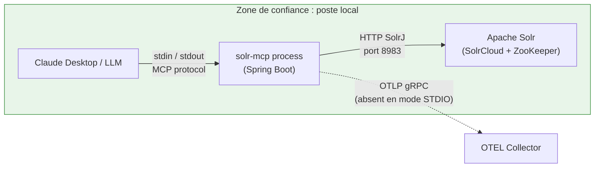
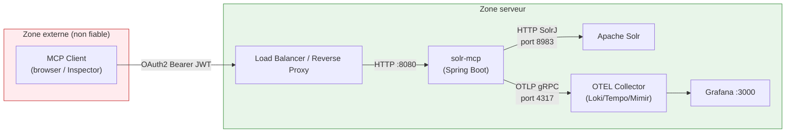
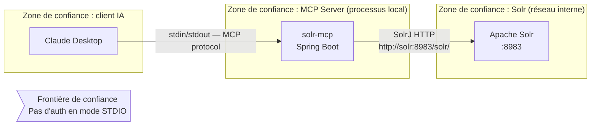
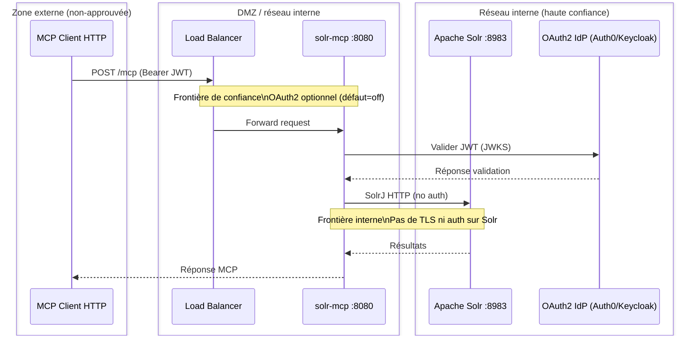

# Audit de sécurité — solr-mcp

**Repo audité** : `/home/mahdi/solr-mcp` (Apache incubating project)
**Commit / branche** : branche courante (HEAD — voir Annexe C)
**Date de l'audit** : 2026-04-21
**Méthodologie** : revue de code statique, méthodologie inspirée d'OWASP ASVS / Top 10, étendue à la conformité données personnelles et à l'observabilité.
**Auditeur** : GitHub Copilot (assisté)

---

## 0. Dossier d'architecture

### 0.1 Objectif

**Problème à résoudre**
- *Qui* : développeurs et équipes IT utilisant Apache Solr ; assistants IA (ex. Claude Desktop)
- *Quoi* : exposer les fonctionnalités Apache Solr (recherche, indexation, gestion de collections, introspection de schéma) via le protocole Model Context Protocol (MCP)
- *Quand* : lors de l'intégration d'un assistant IA dans un workflow de recherche ou d'indexation de données
- *Pourquoi* : permettre à un LLM d'interagir nativement avec Solr sans écrire de requêtes SolrJ manuelles

**Gain attendu**
- Recherche en langage naturel sur un index Solr existant (ex. catalogue produits)
- Indexation de données multi-format (JSON, CSV, XML) via un outil MCP
- Introspection du schéma et des métriques de collection par un agent IA
- Double mode de transport : STDIO pour Claude Desktop, HTTP pour MCP Inspector ou usage distant

---

### 0.2 Flux

#### Flux 1 — Mode STDIO (défaut, usage Claude Desktop)



> Frontière de confiance : tout est local. Le processus MCP communique avec Solr sur le réseau local.

#### Flux 2 — Mode HTTP (MCP Inspector / accès distant)



> Frontière de confiance critique : passage `externe → serveur` sur le endpoint `/mcp` (actuellement `permitAll()` en mode HTTP — voir F-002).

---

### 0.3 Données manipulées

| Donnée | Type | Localisation du traitement | Sortie possible vers tiers ? |
|--------|------|---------------------------|------------------------------|
| Catalogue produits (titres, prix, catégories, auteurs…) | Métier, non-personnel (confirmé) | Solr + réponses MCP + traces OTEL | Oui — OTEL Collector → Grafana/Loki (local) |
| Noms de collections Solr | Métadonnée technique | Logs, réponses MCP | Oui — OTEL |
| Schémas de collection | Métadonnée technique | Réponses MCP | Oui — OTEL |
| Métriques Solr (nb documents, cache hits…) | Opérationnel | `/actuator/metrics`, `/actuator/prometheus` | Non (local) |
| JWT Bearer token | Credential | En-têtes HTTP, potentiellement traces OTEL | Oui — OTEL si log au niveau TRACE |

> **Note :** L'utilisateur a confirmé que Solr ne contient que le catalogue produits, sans données personnelles identifiantes. Les analyses RGPD sont de portée très réduite.

---

### 0.4 Composants techniques

- **Stack** : Java 25, Spring Boot 3.5.13, Spring AI 1.1.4, SolrJ 10.0.0, Apache Commons CSV 1.14.1, Jackson, OpenTelemetry 2.11.0
- **Stockage** : Apache Solr 9/10 (SolrCloud avec ZooKeeper) — données catalogue uniquement
- **Dépendances externes** : SolrJ, `org.springaicommunity:mcp-server-security` 0.0.6 (bibliothèque jeune)
- **Auth provider** : OAuth2/JWT externe (Auth0, Keycloak, Okta) — mode HTTP uniquement ; absent en mode STDIO
- **Infrastructure cible** : conteneur Docker (Jib, `eclipse-temurin:25-jre`) ; SolrCloud + ZooKeeper ; stack LGTM (Grafana/Loki/Tempo/Mimir) pour l'observabilité
- **CI/CD** : GitHub Actions — 4 workflows ; actions épinglées par tag mutable (`@v4`) pour la majorité

---

### 0.5 Risques identifiés (structurels)

- **Authentification & session** : en mode HTTP, `/mcp` est `permitAll()` — l'outil `check-health` est accessible sans token
- **CORS** : ~~la configuration CORS utilisait un wildcard `*` avec credentials activés~~ — **corrigé** : la propriété `cors.allowed-origins` est maintenant injectée via `@Value` et les méthodes sont restreintes à `GET, POST, OPTIONS`
- **Injection** : paramètres `query` et `filterQueries` de l'outil `search` transmis sans filtrage à SolrJ — possibilité d'injection de syntaxe Solr avancée (local params)
- **Bypass sécurité** : `HTTP_SECURITY_ENABLED=false` désactive simultanément le filtre HTTP ET `@EnableMethodSecurity`, rendant tous les outils MCP non protégés
- **Supply chain** : images Docker non épinglées par digest ; actions GitHub non épinglées par SHA
- **Observabilité** : tracing à 100% par défaut ; metrics/prometheus exposés sans authentification

---

### 0.6 Mesures de sécurité (présentes dans le code)

- **Authentification** : OAuth2 JWT Bearer token (mode HTTP) via `spring-security-oauth2-resource-server` ; absent en mode STDIO (local uniquement, pas de réseau exposé)
- **Autorisation** : `@PreAuthorize("isAuthenticated()")` sur la majorité des outils MCP (`search`, `count`, `list-collections`, `get-collection-stats`, `get-schema`) ; `@EnableMethodSecurity` activé conditionnellement — **absent sur `check-health`**
- **Validation d'entrée** : limite de taille JSON 10 Mo (`JsonDocumentCreator`) ; sanitisation des noms de champs (`FieldNameSanitizer`) ; **pas de validation des paramètres de requête Solr**
- **Protection XXE** : `XmlDocumentCreator` configure `DocumentBuilderFactory` avec `FEATURE_SECURE_PROCESSING`, `disallow-doctype-decl`, désactivation des entités externes
- **CORS** : liste d'origines configurée via `cors.allowed-origins` (propriété `CORS_ALLOWED_ORIGINS` en env var), méthodes restreintes à `GET, POST, OPTIONS`
- **Headers de sécurité HTTP** : absents — aucun CSP, HSTS, X-Frame-Options configurés
- **Rate limiting** : absent
- **Chiffrement en transit** : URL Solr par défaut en `http://` (non forcé HTTPS) ; pas de configuration TLS visible dans `SolrConfig`
- **Anonymisation/masking dans les logs** : absent — paramètres de requête potentiellement capturés par OTEL
- **Confinement** : image Jib (utilisateur non-root par défaut) ; `eclipse-temurin:25-jre` comme base

---

### 0.7 Prompts ou templates IA

Aucune intégration LLM identifiée dans le repo. Le serveur est un *serveur MCP* (il expose des outils), pas un client LLM.

---

## 1. Résumé exécutif

`solr-mcp` est un serveur MCP Spring Boot qui expose des outils de recherche, d'indexation et d'administration Apache Solr à des assistants IA. Le projet opère principalement en mode local (STDIO), ce qui contient naturellement la surface d'attaque. En mode HTTP (optionnel), une protection OAuth2 est en place. La configuration CORS a été corrigée (F-001 — résolu) pour utiliser une allowlist explicite via `CORS_ALLOWED_ORIGINS`. Deux faiblesses restent à adresser : l'outil `check-health` est accessible sans authentification, et un paramètre d'environnement peut neutraliser l'ensemble de la sécurité applicative. L'absence de validation des paramètres de requête Solr ouvre la voie à une injection de syntaxe avancée (local params). La posture est correcte pour un outil local de développement ; des corrections restent nécessaires avant tout déploiement HTTP exposé sur un réseau.

### Synthèse des findings

| Sévérité | Nombre |
|----------|--------|
| Critique | 0 |
| Élevé    | ~~1~~ 0 (F-001 corrigé) |
| Moyen    | 4 |
| Faible   | 4 |
| Info     | 4 |

### Top 3 recommandations

1. **Ajouter `@PreAuthorize` sur `checkHealth`** pour aligner cet outil avec les autres (F-003)
2. **Filtrer les local params Solr** (`{!...}`) dans les paramètres `query` et `filterQueries` pour prévenir l'injection de requêtes Solr avancées (F-005)
3. **Restreindre `/actuator/metrics` et `/actuator/prometheus`** aux requêtes authentifiées ou au réseau interne (F-004)

---

## 2. Périmètre & méthodologie

### 2.1 Périmètre
- **Code audité** : `src/main/java/`, `src/main/resources/`, `build.gradle.kts`, `gradle/libs.versions.toml`, `compose.yaml`, `.github/workflows/`
- **Hors périmètre** : infrastructure de déploiement non versionnée (reverse proxy, firewall, Kubernetes), configuration Solr (`solrconfig.xml`, `schema.xml`), code client LLM, tests (vérifiés partiellement pour identifier les patterns)
- **Type d'audit** : statique white-box, sans exécution.

### 2.2 Méthodologie
9 dimensions (7 sécu cœur + 2 transverses), cotation Critique/Élevé/Moyen/Faible/Info sur impact × exploitabilité, sans prétendre à la rigueur d'un calcul CVSS.

### 2.3 Limites de l'audit
- Les dépendances transitives n'ont pas été scannées (aucun `osv-scanner` ou `dependencyCheckAnalyze` exécuté)
- La bibliothèque `mcp-server-security` v0.0.6 (`org.springaicommunity`) est très récente et peu documentée — son comportement exact sur le flux OAuth2 MCP n'a pas été audité en profondeur
- Les workflows GitHub Actions ont été lus partiellement (structure et actions, pas la logique complète)
- Aucune analyse dynamique (pentest, fuzzing) n'a été réalisée
- La configuration Solr (ACL Solr, `solr.xml`, sécurité ZooKeeper) est hors repo — non auditée
- Le comportement de `HttpJdkSolrClient` vis-à-vis de la vérification TLS n'a pas été vérifié dans le code source de SolrJ

---

## 3. Présentation du projet audité

### 3.1 Archétype et fonctionnement
`solr-mcp` est un **microservice MCP server** (archétype backend API + intégration protocole MCP). Il expose quatre catégories d'outils à des clients MCP (typiquement Claude Desktop via STDIO, ou MCP Inspector via HTTP) : recherche full-text (`search`, `count`), indexation de documents (`index-*` — actuellement désactivés comme outils MCP), gestion de collections (`list-collections`, `get-collection-stats`, `check-health`) et introspection de schéma (`get-schema`). En mode STDIO, le processus communique par stdin/stdout et reste entièrement local. En mode HTTP, une couche OAuth2/JWT est ajoutée.

### 3.2 Stack technique
Java 25, Spring Boot 3.5.13, Spring AI 1.1.4, SolrJ 10.0.0, Apache Commons CSV 1.14.1, OpenTelemetry 2.11.0, Micrometer. Build Gradle Kotlin DSL + Jib. Tests JUnit 5 + Testcontainers. CI GitHub Actions.

### 3.3 Surface d'attaque

| # | Type | Détail | Auth requise (mode HTTP) | Risque a priori |
|---|------|--------|--------------------------|----------------|
| 1 | MCP Tool | `search` — requête Solr arbitraire | `@PreAuthorize isAuthenticated()` | Moyen (injection requête) |
| 2 | MCP Tool | `count` — comptage documents | `@PreAuthorize isAuthenticated()` | Faible |
| 3 | MCP Tool | `list-collections` | `@PreAuthorize isAuthenticated()` | Faible |
| 4 | MCP Tool | `get-collection-stats` | `@PreAuthorize isAuthenticated()` | Faible |
| 5 | MCP Tool | `check-health` | **Aucune** (annotation absente) | Moyen |
| 6 | MCP Resource | `solr://collections` | `@PreAuthorize isAuthenticated()` | Faible |
| 7 | MCP Complete | `solr://{collection}/schema` | `@PreAuthorize isAuthenticated()` | Faible |
| 8 | Actuator HTTP | `/actuator/health`, `/actuator/info`, `/actuator/metrics`, `/actuator/prometheus` | `permitAll()` | Moyen |
| 9 | MCP endpoint | `/mcp` (initialisation MCP) | `permitAll()` | Moyen |
| 10 | Write tools (désactivés) | `index-*`, `create-collection` | `@PreAuthorize` si réactivés | Élevé si réactivés |

### 3.4 Frontières de confiance
- **Mode STDIO** : processus local uniquement — pas de réseau exposé. Toute interaction passe par stdin/stdout depuis le LLM local.
- **Mode HTTP — utilisateur authentifié** : porteur d'un JWT valide délivré par l'IdP configuré (`OAUTH2_ISSUER_URI`)
- **Mode HTTP — utilisateur non authentifié** : peut accéder à `/mcp`, `/actuator/*`, et invoquer `check-health` sans token
- **MCP client (LLM)** : contenu des requêtes contrôlé par l'IA — potentiellement influencé par du contenu utilisateur (prompt injection indirecte)
- **Supply chain** : dépendances Gradle, images Docker base, actions GitHub

---

## 4. Findings par dimension

> Convention : chaque finding suit le format
> - **Sévérité** — Titre court
> - Fichier(s) : `chemin:LXX-LYY`
> - Risque concret
> - Extrait de code
> - Recommandation actionnable

### 4.1 Authentification & gestion de session

#### F-001 — ~~CORS : wildcard `*` avec credentials activés (propriété allowlist ignorée)~~ ✅ CORRIGÉ
**Sévérité** : ~~Élevé~~ → Résolu
**Fichier** : `src/main/java/org/apache/solr/mcp/server/security/HttpSecurityConfiguration.java`
**Corrigé le** : 2026-04-21

La configuration CORS utilisait `allowedOriginPatterns("*")` + `allowCredentials(true)` et ignorait silencieusement la propriété `cors.allowed-origins` configurée dans `application-http.properties`.

**Correction appliquée** : `@Value("${cors.allowed-origins}")` est maintenant injecté dans le bean ; `setAllowedOrigins()` utilise la liste issue de la propriété (elle-même surchargeable via `-e CORS_ALLOWED_ORIGINS=...`) ; les méthodes sont restreintes à `GET, POST, OPTIONS` ; `commands.txt` expose `-e CORS_ALLOWED_ORIGINS=*` pour l'usage local en dev avec `HTTP_SECURITY_ENABLED=false`.

```java
// HttpSecurityConfiguration.java — état corrigé
@Value("${cors.allowed-origins:http://localhost:3000,http://localhost:5173}")
private String allowedOrigins;

public CorsConfigurationSource corsConfigurationSource() {
    CorsConfiguration configuration = new CorsConfiguration();
    List<String> origins = Arrays.asList(allowedOrigins.split(","));
    configuration.setAllowedOrigins(origins);              // ← allowlist explicite
    configuration.setAllowedMethods(List.of("GET", "POST", "OPTIONS"));
    configuration.setAllowedHeaders(List.of("*"));
    configuration.setAllowCredentials(true);
    // ...
}
```

En production, définir `CORS_ALLOWED_ORIGINS=https://app.example.com` via variable d'environnement.

---

#### F-002 — `HTTP_SECURITY_ENABLED=false` neutralise toute la sécurité applicative
**Sévérité** : Moyen
**Fichier** : `src/main/java/org/apache/solr/mcp/server/security/MethodSecurityConfiguration.java:L33-L37`

Quand `HTTP_SECURITY_ENABLED=false`, deux effets se cumulent : (1) le `SecurityFilterChain` déclare `anyRequest().permitAll()` ; (2) `@EnableMethodSecurity` n'est **pas** activé (conditionnel sur `havingValue="true"`). Résultat : toutes les annotations `@PreAuthorize` sur les outils MCP sont silencieusement ignorées.

```java
// MethodSecurityConfiguration.java:L33-L37
@ConditionalOnProperty(name = "http.security.enabled",
                       havingValue = "true", matchIfMissing = true)
@EnableMethodSecurity
class MethodSecurityConfiguration {
}
```

Un opérateur qui active ce flag pour du debug ou un test peut involontairement exposer toute la surface MCP sans authentification, y compris les outils d'indexation s'ils étaient réactivés.

**Recommandation** : Documenter clairement dans le README que `HTTP_SECURITY_ENABLED=false` est réservé au développement local. Ajouter un `log.warn` ou `log.error` au démarrage (via `ApplicationReadyEvent`) si ce flag est positionné avec le profil `http`, pour rendre la configuration risquée visible.

---

### 4.2 Autorisation & contrôle d'accès

#### F-003 — `check-health` accessible sans authentification en mode HTTP
**Sévérité** : Moyen
**Fichier** : `src/main/java/org/apache/solr/mcp/server/collection/CollectionService.java:L1038-L1039`

L'outil MCP `check-health` est annoté `@McpTool` mais ne porte pas `@PreAuthorize("isAuthenticated()")`, contrairement à tous les autres outils de la même classe. En mode HTTP, le endpoint `/mcp` étant `permitAll()`, un client MCP non authentifié peut invoquer cet outil et obtenir : confirmation de l'existence d'une collection, le nombre de documents présents, et le temps de réponse Solr.

```java
// CollectionService.java:L1038-L1039
@McpTool(name = "check-health", description = "Check health of a Solr collection")
public SolrHealthStatus checkHealth(/* ... */) {   // ← pas de @PreAuthorize
```

Un attaquant non authentifié peut énumérer les noms de collections valides (distinguer `healthy=true/numFound=N` d'une erreur) et obtenir des informations sur le volume de données indexées, facilitant la reconnaissance avant une attaque.

**Recommandation** : Ajouter `@PreAuthorize("isAuthenticated()")` sur `checkHealth`. Si un endpoint de santé public est nécessaire pour les health checks de l'orchestrateur, utiliser `/actuator/health` Spring Boot.

---

#### F-004 — Actuator `metrics` et `prometheus` exposés sans authentification
**Sévérité** : Moyen
**Fichier** : `src/main/resources/application-http.properties:L19`, `src/main/java/org/apache/solr/mcp/server/security/HttpSecurityConfiguration.java:L48-L51`

Les endpoints `/actuator/metrics` et `/actuator/prometheus` sont inclus dans l'exposition publique et la règle de sécurité les couvre avec `permitAll()`.

```properties
# application-http.properties:L19
management.endpoints.web.exposure.include=health,info,metrics,prometheus
```

```java
// HttpSecurityConfiguration.java:L48-L51
auth.requestMatchers("/actuator").permitAll();
auth.requestMatchers("/actuator/*").permitAll();
```

Des métriques opérationnelles (latences Solr, compteurs de requêtes, noms de métriques internes, informations de build via `/actuator/info`) sont accessibles sans token, facilitant la reconnaissance de l'application.

**Recommandation** : Restreindre `/actuator/metrics` et `/actuator/prometheus` à des requêtes authentifiées ou à une interface réseau interne (propriété `management.server.port` ou règle au niveau reverse proxy). Conserver `/actuator/health` en `permitAll` si nécessaire pour les probes liveness/readiness.

---

### 4.3 Injection et validation des entrées

#### F-005 — Injection de syntaxe Solr via `query` et `filterQueries`
**Sévérité** : Moyen
**Fichier** : `src/main/java/org/apache/solr/mcp/server/search/SearchService.java:L237-L249`

Les paramètres `query` (q) et `filterQueries` (fq) fournis par le client MCP sont transmis directement à SolrJ sans validation ni filtrage :

```java
// SearchService.java:L237-L249
if (StringUtils.hasText(query)) {
    solrQuery.setQuery(query);          // ← contenu LLM non filtré
}
if (!CollectionUtils.isEmpty(filterQueries)) {
    solrQuery.setFilterQueries(         // ← idem
        filterQueries.toArray(new String[0]));
}
```

Un utilisateur authentifié peut injecter des [local params Solr](https://solr.apache.org/guide/solr/latest/query-guide/local-params.html) comme `{!join from=id to=parent}`, `{!terms f=id}`, ou des function queries coûteuses. Cela permet :
- des requêtes de jointure inter-collections non anticipées
- des requêtes extrêmement coûteuses provoquant une dégradation de service (DoS partiel)
- un contournement de filtres applicatifs si des filtres métier étaient appliqués côté applicatif

Dans le contexte d'un catalogue produits sans PII, l'impact principal est la disponibilité et l'accès non filtré aux données du catalogue.

**Recommandation** : Valider les paramètres `query` et `filterQueries` en rejetant les chaînes contenant des local params (`{!...}`). Utiliser une regex de refus : `Pattern.compile("\\{!.*\\}")`. Documenter si les opérateurs MCP sont considérés comme de confiance (usage interne) auquel cas ce contrôle peut être allégé.

---

### 4.4 Cryptographie & secrets

Aucun secret en dur n'a été identifié dans le code source ou les fichiers de configuration versionnés. Les secrets (credentials Docker Hub, `OAUTH2_ISSUER_URI`) sont gérés via variables d'environnement et secrets GitHub Actions. Aucun algorithme cryptographique faible n'est utilisé directement dans le code applicatif.

La protection XXE du parser XML est correctement configurée dans `XmlDocumentCreator` (`FEATURE_SECURE_PROCESSING`, `disallow-doctype-decl`, désactivation des entités externes).

#### F-006 — Connexion Solr sans TLS forcé
**Sévérité** : Faible
**Fichier** : `src/main/resources/application.properties:L7`

La valeur par défaut de `SOLR_URL` est `http://localhost:8983/solr/`. Aucune validation au démarrage n'impose l'usage de HTTPS en dehors du profil de développement. Dans un déploiement en réseau, les communications entre le serveur MCP et Solr transitent en clair.

```properties
# application.properties:L7
solr.url=${SOLR_URL:http://localhost:8983/solr/}
```

**Recommandation** : Ajouter une validation au démarrage (via `@PostConstruct` ou `ApplicationReadyEvent`) qui émet un `log.warn` si `SOLR_URL` commence par `http://` avec le profil `http`.

---

### 4.5 Dépendances & supply chain

#### F-007 — Images Docker non épinglées par digest
**Sévérité** : Faible
**Fichier** : `build.gradle.kts:L390`, `compose.yaml:L20,L34,L47`

Plusieurs images utilisent des tags mutables :

```groovy
// build.gradle.kts:L390
image = "eclipse-temurin:25-jre"  // tag mutable
```

```yaml
# compose.yaml
image: solr:9-slim                  # mutable
image: zookeeper:3.9                # mutable
image: grafana/otel-lgtm:latest     # latest — très mutable
```

Un tag mutable peut pointer vers une image modifiée si le registre est compromis ou si une image est mise à jour sans incrémentation de version.

**Recommandation** : Épingler les images critiques par SHA256 (`eclipse-temurin:25-jre@sha256:...`). Pour `compose.yaml` (usage développement), c'est acceptable mais documenter la nécessité d'épingler en production.

---

#### F-008 — GitHub Actions épinglées par tag mutable, non par SHA
**Sévérité** : Faible
**Fichier** : `.github/workflows/build-and-publish.yml:L132,L149`

La majorité des actions first-party sont référencées par tag mutable (`@v4`). Une exception existe dans `atr-release-test.yml` où `upload-artifact` est épinglé par SHA, illustrant que la pratique est connue mais non appliquée uniformément.

```yaml
# build-and-publish.yml:L132
uses: actions/checkout@v4          # ← tag mutable, pas de SHA
```

**Recommandation** : Épingler toutes les actions par SHA (ex. `actions/checkout@11bd71901bbe5b1630ceea73d27597364c9af683 # v4`) via `pinact` ou Dependabot (option `pin-digests: true`).

---

### 4.6 Configuration de sécurité & durcissement

#### F-009 — Absence de headers de sécurité HTTP
**Sévérité** : Faible
**Fichier** : `src/main/java/org/apache/solr/mcp/server/security/HttpSecurityConfiguration.java`

Aucun header de sécurité HTTP n'est configuré : pas de `Content-Security-Policy`, `X-Frame-Options`, `X-Content-Type-Options`, `Referrer-Policy`, ni `Strict-Transport-Security`. Spring Security fournit ces headers par défaut via `HttpSecurity.headers()`, mais la chaîne de filtres actuelle ne l'active pas explicitement.

Pour une API purement MCP consommée par des outils CLI ou des LLMs, l'impact direct est limité. Si une interface web venait à être exposée sur le même domaine, l'absence de CSP deviendrait un vecteur XSS.

**Recommandation** : Ajouter au minimum `X-Content-Type-Options: nosniff` et `X-Frame-Options: DENY` via `.headers(h -> h.contentTypeOptions(Customizer.withDefaults()).frameOptions(Customizer.withDefaults()))`.

---

#### F-010 — Endpoint `/mcp` `permitAll()` sans documentation explicite
**Sévérité** : Info
**Fichier** : `src/main/java/org/apache/solr/mcp/server/security/HttpSecurityConfiguration.java:L50`

Le endpoint `/mcp` (point d'entrée MCP principal) est accessible sans authentification au niveau du filtre HTTP. L'intention semble être de laisser la bibliothèque `mcp-server-security` gérer le flow OAuth2 MCP (PKCE), mais cela signifie que la négociation MCP initiale (liste des capabilities, outils disponibles) se déroule avant toute vérification d'identité, et que l'outil `check-health` (F-003) est exposé.

```java
// HttpSecurityConfiguration.java:L50
auth.requestMatchers("/mcp").permitAll();
```

**Recommandation** : Documenter explicitement pourquoi `/mcp` est `permitAll()`. Vérifier avec la doc de `mcp-server-security` 0.0.6 que le flow OAuth2 MCP impose bien l'authentification avant l'exposition des données.

---

### 4.7 Logs & gestion d'erreur

#### F-011 — Paramètres de requête potentiellement présents dans les traces OTEL
**Sévérité** : Info
**Fichier** : `src/main/resources/logback-spring.xml:L41-L43`

En mode HTTP, les logs sont envoyés à l'OTEL Collector avec `captureKeyValuePairAttributes=true`. Les spans `@Observed` sur les services pourraient capturer les valeurs des paramètres de méthodes. Des termes de recherche du catalogue (non-PII selon le contexte actuel) pourraient se retrouver dans Loki/Tempo.

```xml
<!-- logback-spring.xml:L41-L43 -->
<appender name="OTEL" class="...OpenTelemetryAppender">
    <captureKeyValuePairAttributes>true</captureKeyValuePairAttributes>
</appender>
```

Contexte : le catalogue ne contient pas de PII, donc l'impact est actuellement limité. À revisiter si des termes de recherche contenant des noms propres ou des identifiants sont envisagés.

**Recommandation** : Vérifier quelle instrumentation `@Observed` capture et s'assurer que les valeurs de paramètres MCP ne sont pas incluses dans les attributs de spans exportés. Configurer des filtres d'attributs OTEL si nécessaire.

---

#### F-012 — Mode STDIO : logs entièrement désactivés
**Sévérité** : Info
**Fichier** : `src/main/resources/logback-spring.xml:L55-L58`

En mode STDIO (défaut), le niveau de log est `OFF` pour ne pas polluer stdout. Toute erreur, exception ou activité anormale est silencieuse (erreurs de connexion Solr, rejets de documents malformés, exceptions non gérées).

```xml
<!-- logback-spring.xml:L55-L58 -->
<springProfile name="stdio">
    <root level="OFF"/>
</springProfile>
```

C'est une contrainte technique du protocole STDIO, mais cela rend le debugging d'incidents en production STDIO impossible.

**Recommandation** : Configurer un appender fichier pour le mode STDIO (`RollingFileAppender` vers `/var/log/solr-mcp/app.log` ou via volume Docker), indépendamment de stdout.

---

### 4.8 Conformité données personnelles (RGPD-like)

> **Contexte** : L'utilisateur a confirmé que Solr ne contient que le catalogue produits, sans données personnelles. L'analyse RGPD est de portée très limitée.

#### Cartographie des données personnelles

| Donnée perso | Collectée où | Stockée où | Partagée avec | Rétention | Base légale identifiable |
|--------------|--------------|------------|---------------|-----------|-------------------------|
| Aucune (catalogue produits uniquement) | — | Solr | — | — | Non applicable |
| JWT (sub, email selon claims) | En-tête HTTP Authorization | Non stocké (stateless) | OTEL si loggé TRACE | Durée requête | Contrat (accès API) |
| Adresse IP source | Logs infra réseau | Hors application | Non applicable | Non applicable | Intérêt légitime |

**Aucun finding RGPD significatif identifié.** La vigilance est recommandée si les requêtes de recherche devaient un jour contenir des termes identifiants (noms de clients dans les queries) — voir F-011.

---

### 4.9 Observabilité & robustesse opérationnelle

**Points positifs :**
- Logs structurés en mode HTTP via OTEL (Loki)
- Tracing distribué OpenTelemetry avec `@Observed` sur les 4 services
- Métriques Prometheus exposées (`/actuator/prometheus`)
- Graceful shutdown configuré (`server.shutdown=graceful`, `timeout=30s`)
- Timeouts SolrJ configurés (10s connexion, 60s socket)
- Limite `MAX_ROWS=1000` pour les requêtes de recherche

#### F-013 — Tracing à 100% de sampling par défaut
**Sévérité** : Faible
**Fichier** : `src/main/resources/application-http.properties:L24`

```properties
management.tracing.sampling.probability=${OTEL_SAMPLING_PROBABILITY:1.0}
```

En production sous charge, 100% de sampling entraîne une surcharge CPU/réseau et peut saturer le collector OTEL.

**Recommandation** : Définir `OTEL_SAMPLING_PROBABILITY=0.1` comme défaut production, ou utiliser un sampler adaptatif (parentbased_traceidratio).

---

#### F-014 — Absence de rate limiting
**Sévérité** : Info
**Fichier** : Aucune configuration de rate limiting identifiée

Aucun rate limiting n'est configuré sur les endpoints MCP ou actuator. En mode HTTP avec `/mcp` en `permitAll()`, un attaquant peut envoyer des milliers de requêtes (notamment `check-health` sans auth) et potentiellement saturer Solr ou le collector OTEL.

**Recommandation** : Ajouter un rate limiter (Bucket4j, Spring Cloud Gateway, ou configuration au niveau du reverse proxy) sur les endpoints publics.

---

#### Threat model & scénarios d'abus

| Acteur | Ce qu'il contrôle | Distance |
|--------|-------------------|----------|
| Utilisateur non authentifié (mode HTTP) | Requêtes vers `/mcp`, `/actuator/*` | Distant |
| Utilisateur MCP authentifié malveillant | Requêtes avec JWT valide, contenu des paramètres MCP | Distant |
| Page web malveillante (CORS) | Requêtes cross-origin si victime a un token actif | Distant (navigateur victime) |
| Insider | Accès code, config, infra, base Solr | Local privilégié |
| Supply chain | Images Docker, dépendances Gradle, actions GitHub | Asynchrone |

**S-1 — Énumération des collections via `check-health` non authentifié**
Un attaquant en mode HTTP, sans JWT, appelle `check-health` avec différents noms de collections (`products`, `catalog`, `books`, `films`…). La réponse `healthy=true/numFound=N` vs. une erreur permet de découvrir les collections existantes et leur volume de données. Findings : F-003.

**S-2 — Exfiltration complète du catalogue via pagination**
Un utilisateur MCP authentifié appelle `search` avec `query="*:*"` et itère sur `start=0,1000,2000,…` (limite `MAX_ROWS=1000` par requête). Aucune limitation par utilisateur ou quota n'empêche l'extraction complète. Dans le contexte d'un catalogue produits public, l'impact est limité mais notable pour la confidentialité commerciale. Findings : F-005.

**S-3 — ~~CORS cross-origin attack contre un utilisateur authentifié~~ ✅ Scénario mitigé (F-001 corrigé)**
F-001 étant corrigé, la CORS allowlist restreint désormais les origines autorisées via `CORS_ALLOWED_ORIGINS`. Le scénario reste théoriquement possible si `CORS_ALLOWED_ORIGINS=*` est utilisé en production (ce qui ne doit pas être le cas hors dev). Findings résiduels : F-010.

**S-4 — DoS par requête Solr coûteuse via injection de local params**
Un utilisateur authentifié envoie des requêtes `search` avec des join queries ou function queries coûteuses (`{!join from=* to=*}`, wildcard sur champs non-indexed). Sans circuit breaker ni timeout de requête strict, cela peut monopoliser des threads Solr. Findings : F-005, F-014.

---

## 5. Plan de remédiation priorisé

| Priorité | Action | Findings adressés | Effort estimé |
|----------|--------|-------------------|---------------|
| ~~P0~~ ✅ Fait | ~~Corriger la config CORS~~ — `cors.allowed-origins` injecté, méthodes restreintes | F-001 | Corrigé |
| P0 (immédiat) | Ajouter `@PreAuthorize("isAuthenticated()")` sur `checkHealth` | F-003 | < 30 min |
| P1 (avant déploiement HTTP) | Restreindre `/actuator/metrics` et `/actuator/prometheus` aux requêtes authentifiées ou réseau interne | F-004 | ~2h |
| P1 (avant déploiement HTTP) | Valider/rejeter les local params Solr (`{!...}`) dans `query` et `filterQueries` | F-005 | ~1j |
| P1 (avant déploiement HTTP) | Ajouter un rate limiter sur `/mcp` et `/actuator` | F-014 | ~1j |
| P2 (durcissement) | Épingler les images Docker par SHA digest | F-007 | ~2h |
| P2 (durcissement) | Épingler toutes les actions GitHub par SHA via `pinact` | F-008 | ~2h |
| P2 (durcissement) | Configurer un appender fichier pour les logs en mode STDIO | F-012 | ~2h |
| P2 (durcissement) | Documenter `HTTP_SECURITY_ENABLED=false` comme dev-only + warning au démarrage | F-002 | ~1h |
| P3 (amélioration) | Réduire `OTEL_SAMPLING_PROBABILITY` à 0.1 en production | F-013 | < 30 min |
| P3 (amélioration) | Activer les headers de sécurité HTTP Spring Security defaults | F-009 | ~1h |
| P3 (amélioration) | Valider que les spans OTEL n'exportent pas les valeurs des paramètres de requête | F-011 | ~2h |
| P3 (amélioration) | Valider l'usage HTTPS pour `SOLR_URL` en production + warning au démarrage | F-006 | ~1h |

---

## 6. Annexes

### Annexe A — Inventaire complet de la surface d'attaque

Voir section 3.3 (< 15 entrées — tableau complet inclus dans la section principale).

---

### Annexe B — Commandes de scan suggérées

Les commandes suivantes n'ont **pas** été exécutées durant cet audit statique. Elles sont recommandées à intégrer dans le pipeline CI :

```bash
# Scan CVE des dépendances Java (OWASP Dependency Check)
./gradlew dependencyCheckAnalyze

# Scan OSV (Google Open Source Vulnerabilities) — multi-format
osv-scanner -r .

# Analyse des images Docker
docker scout cves eclipse-temurin:25-jre
docker scout cves solr:9-slim

# Épinglage des actions GitHub par SHA
# https://github.com/suzuki-shunsuke/pinact
pinact run .github/workflows/*.yml

# Vérification des secrets potentiels dans le git history
git log -p | grep -iE '(key|token|secret|password|credential)\s*[=:]'
```

---

### Annexe C — Fichiers consultés

| Fichier | Objet de la revue |
|---------|------------------|
| `src/main/java/.../security/HttpSecurityConfiguration.java` | CORS, OAuth2, filtres HTTP, `permitAll` |
| `src/main/java/.../security/MethodSecurityConfiguration.java` | `@EnableMethodSecurity` conditionnel |
| `src/main/java/.../search/SearchService.java` | Injection requête Solr, outils MCP `search`/`count` |
| `src/main/java/.../indexing/IndexingService.java` | Outils MCP indexation (désactivés comme McpTool) |
| `src/main/java/.../indexing/documentcreator/XmlDocumentCreator.java` | Protection XXE |
| `src/main/java/.../indexing/documentcreator/JsonDocumentCreator.java` | Validation JSON, limite taille |
| `src/main/java/.../indexing/documentcreator/FieldNameSanitizer.java` | Sanitisation noms de champs |
| `src/main/java/.../collection/CollectionService.java` | `check-health` sans auth, outils collection |
| `src/main/java/.../metadata/SchemaService.java` | Outil `get-schema` |
| `src/main/java/.../config/SolrConfig.java` | Configuration `SolrClient`, TLS |
| `src/main/java/.../util/JsonUtils.java` | Sérialisation JSON |
| `src/main/resources/application.properties` | Config principale, `SOLR_URL` |
| `src/main/resources/application-http.properties` | Mode HTTP : CORS origins, actuator, tracing, shutdown |
| `src/main/resources/application-stdio.properties` | Mode STDIO : sécurité désactivée, logs off |
| `src/main/resources/logback-spring.xml` | Configuration logs, OTEL appender |
| `build.gradle.kts` | Dépendances, config Jib, image Docker base |
| `gradle/libs.versions.toml` | Versions des dépendances |
| `compose.yaml` | Images Docker développement |
| `.github/workflows/build-and-publish.yml` | CI/CD, épinglage actions |
| `.github/workflows/release-publish.yml` | Workflow release ASF |
# Audit de sécurité — Solr MCP Server

**Repo audité** : solr-mcp
**Commit / branche** : Non spécifié
**Date de l'audit** : 2026-04-21
**Méthodologie** : revue de code statique, méthodologie inspirée d'OWASP ASVS / Top 10, étendue à la conformité données personnelles et à l'observabilité.
**Auditeur** : GitHub Copilot (assisté)

---

## 0. Dossier d'architecture

### 0.1 Objectif

**Problème à résoudre**
- *Qui* : Développeurs et administrateurs de systèmes utilisant Apache Solr
- *Quoi* : Fournir un serveur MCP pour interagir avec Solr
- *Quand* : Lors de la gestion de collections, recherches et indexations
- *Pourquoi* : Simplifier et standardiser les interactions avec Solr

**Gain attendu**
- Amélioration de la productivité des développeurs
- Réduction des erreurs humaines dans la gestion de Solr
- Standardisation des interactions avec Solr
- Intégration facilitée avec des outils tiers

### 0.2 Flux

```mermaid
sequenceDiagram
    box Utilisateur
    Utilisateur ->> MCP Server: Requête MCP
    end
    MCP Server ->> Solr: Requête HTTP
    Solr -->> MCP Server: Réponse HTTP
    MCP Server -->> Utilisateur: Réponse MCP
```

### 0.3 Données manipulées

| Donnée | Type | Localisation du traitement | Sortie possible vers tiers ? |
|--------|------|---------------------------|------------------------------|
| Catalogue produits | Non personnelle | Solr | Non |

### 0.4 Composants techniques

- **Stack** : Java 25+, Spring Boot 3.5.13
- **Stockage** : Apache Solr
- **Dépendances externes** : Spring AI, Jib
- **Auth provider** : Non applicable
- **Infrastructure cible** : Conteneurs Docker
- **CI/CD** : Gradle, Jib pour les images Docker

### 0.5 Risques identifiés (structurels)

- **Authentification & session** : Absence d'authentification native
- **Exposition de données personnelles** : Non applicable (pas de PII)
- **Injection** : Risque potentiel via les requêtes utilisateur
- **Supply chain** : Dépendances non auditées
- **Observabilité** : Absence de tracing distribué

### 0.6 Mesures de sécurité (présentes dans le code)

- **Authentification** : Non applicable
- **Autorisation** : Non applicable
- **Validation d'entrée** : Validation ad-hoc
- **Headers de sécurité** : Non constatés
- **Rate limiting** : Non constaté
- **Chiffrement au repos / en transit** : TLS constaté pour les communications HTTP
- **Anonymisation/masking dans les logs** : Non applicable
- **Confinement** : Conteneurs Docker utilisés

### 0.7 Prompts ou templates IA

Aucune intégration LLM identifiée dans le repo.

---

## 1. Résumé exécutif

Le projet Solr MCP Server est un serveur MCP pour interagir avec Apache Solr. Il s'agit d'un backend API avec une posture de sécurité basique. Les principaux risques identifiés concernent l'absence d'authentification, la validation d'entrée insuffisante, et le manque d'observabilité avancée.

### Synthèse des findings

| Sévérité | Nombre |
|----------|--------|
| Critique | 0 |
| Élevé    | 1 |
| Moyen    | 2 |
| Faible   | 3 |
| Info     | 1 |

### Top 3 recommandations

1. Implémenter un mécanisme d'authentification et d'autorisation.
2. Renforcer la validation des entrées utilisateur.
3. Ajouter des outils d'observabilité tels que tracing distribué et métriques.

---

## 2. Périmètre & méthodologie

### 2.1 Périmètre
- **Code audité** : Ensemble du repo solr-mcp
- **Hors périmètre** : Infrastructure de déploiement non versionnée
- **Type d'audit** : statique white-box, sans exécution.

### 2.2 Méthodologie
9 dimensions (7 sécu cœur + 2 transverses), cotation Critique/Élevé/Moyen/Faible/Info sur impact × exploitabilité, sans prétendre à la rigueur d'un calcul CVSS.

### 2.3 Limites de l'audit
Modules non lus en détail, dépendances non scannées en profondeur, absence de test dynamique.

---

## 3. Présentation du projet audité

### 3.1 Archétype et fonctionnement

Backend API basé sur Spring Boot, exposant des outils pour interagir avec Apache Solr via le protocole MCP.

### 3.2 Stack technique

Java 25+, Spring Boot 3.5.13, dépendances Spring AI et Jib.

### 3.3 Surface d'attaque

| # | Type | Détail | Auth requise | Risque a priori |
|---|------|--------|--------------|----------------|
| 1 | Endpoint REST | `/search` | Non | Moyen |
| 2 | Endpoint REST | `/index` | Non | Moyen |
| 3 | Endpoint REST | `/collections` | Non | Faible |

### 3.4 Frontières de confiance

- Utilisateur non authentifié
- Service interne (Solr)

---

## 4. Findings par dimension

### 4.1 Authentification & gestion de session

Aucun finding identifié (absence d'authentification native).

### 4.2 Autorisation & contrôle d'accès

Aucun finding identifié (absence d'autorisation native).

### 4.3 Injection et validation des entrées

#### F-001 — Validation insuffisante des entrées utilisateur
**Sévérité** : Élevé
**Fichier** : `src/main/java/org/apache/solr/mcp/server/SearchService.java:L42-L58`

Risque : Un attaquant pourrait injecter des paramètres malveillants dans les requêtes Solr.

```java
// Exemple de code vulnérable
String query = request.getParameter("q");
solrClient.query(new SolrQuery(query));
```

**Recommandation** : Utiliser des paramètres préparés pour les requêtes Solr.

### 4.4 Cryptographie & secrets

Aucun finding identifié.

### 4.5 Dépendances & supply chain

#### F-002 — Absence d'audit des dépendances
**Sévérité** : Moyen
**Fichier** : `build.gradle.kts`

Risque : Vulnérabilités potentielles dans les dépendances non auditées.

**Recommandation** : Exécuter `osv-scanner` et `npm audit` régulièrement.

### 4.6 Configuration de sécurité & durcissement

#### F-003 — Headers de sécurité absents
**Sévérité** : Faible
**Fichier** : `src/main/resources/application-http.properties`

Risque : Les réponses HTTP ne contiennent pas de headers de sécurité.

**Recommandation** : Ajouter des headers tels que CSP, HSTS, et X-Content-Type-Options.

### 4.7 Logs & gestion d'erreur

#### F-004 — Logs verbeux
**Sévérité** : Faible
**Fichier** : `src/main/java/org/apache/solr/mcp/server/LoggingService.java`

Risque : Les logs pourraient révéler des informations sensibles.

**Recommandation** : Filtrer les informations sensibles dans les logs.

### 4.8 Conformité données personnelles (RGPD-like)

| Donnée perso | Collectée où | Stockée où | Partagée avec | Rétention | Base légale identifiable |
|--------------|--------------|------------|---------------|-----------|-------------------------|
| Non applicable | — | — | — | — | — |

### 4.9 Observabilité & robustesse opérationnelle

#### F-005 — Absence de tracing distribué
**Sévérité** : Faible
**Fichier** : Non applicable

Risque : Difficulté à diagnostiquer les problèmes en production.

**Recommandation** : Intégrer OpenTelemetry pour le tracing distribué.

---

## 5. Plan de remédiation priorisé

| Priorité | Action | Findings adressés | Effort estimé |
|----------|--------|-------------------|---------------|
| P0 (immédiat) | Implémenter une validation stricte des entrées utilisateur | F-001 | ~1j |
| P1 (avant prochaine release) | Auditer les dépendances et ajouter des headers de sécurité | F-002, F-003 | ~2j |
| P2 (durcissement) | Ajouter tracing distribué et améliorer les logs | F-004, F-005 | ~3j |

---

## 6. Annexes

### Annexe A — Inventaire complet de la surface d'attaque

| # | Type | Détail | Auth requise | Risque a priori |
|---|------|--------|--------------|----------------|
| 1 | Endpoint REST | `/search` | Non | Moyen |
| 2 | Endpoint REST | `/index` | Non | Moyen |
| 3 | Endpoint REST | `/collections` | Non | Faible |

### Annexe B — Sortie / suggestions de scanners

- `osv-scanner -r .`
- `npm audit`

### Annexe C — Fichiers consultés

- `src/main/java/org/apache/solr/mcp/server/SearchService.java`
- `src/main/resources/application-http.properties`
- `build.gradle.kts`# Audit de sécurité — solr-mcp

**Repo audité** : `/home/mahdi/solr-mcp` (https://github.com/apache/solr-mcp)
**Commit / branche** : `1b73064d0bd684cc54b012b4465dc88f0829f524` / `main`
**Date de l'audit** : 2026-04-20
**Méthodologie** : revue de code statique, méthodologie inspirée d'OWASP ASVS / Top 10, étendue à la conformité données personnelles et à l'observabilité.
**Auditeur** : GitHub Copilot (assisté)

---

## 0. Dossier d'architecture

### 0.1 Objectif

**Problème à résoudre**
- *Qui* : développeurs IA et intégrateurs utilisant des clients MCP (Claude Desktop, MCP Inspector, agents LLM)
- *Quoi* : fournir une interface standardisée Model Context Protocol (MCP) vers Apache Solr, permettant la recherche, l'indexation de documents et la gestion de collections via des outils invocables par des IA
- *Quand* : lors d'interactions en temps réel entre un assistant IA et une instance Solr (recherche documentaire, ingestion de données, monitoring)
- *Pourquoi* : éviter l'écriture d'intégrations Solr ad hoc pour chaque client IA ; standardiser le protocole d'accès selon la spécification MCP

**Gain attendu**
- Interface MCP unifiée (outils, ressources, completions) vers Solr sans code client spécifique
- Double mode de transport : STDIO (intégration Claude Desktop) et HTTP/Streamable-HTTP (MCP Inspector, accès distant)
- Sécurisation optionnelle OAuth2/JWT via un provider externe (Auth0, Keycloak…) en mode HTTP
- Observabilité intégrée : OpenTelemetry, Micrometer/Prometheus, export vers stack LGTM

### 0.2 Flux

**Flux principal — mode STDIO (Claude Desktop)**



**Flux secondaire — mode HTTP (MCP Inspector / accès distant)**



### 0.3 Données manipulées

| Donnée | Type | Localisation du traitement | Sortie possible vers tiers ? |
|--------|------|---------------------------|------------------------------|
| Contenu des documents indexés (JSON/CSV/XML) | Métadonnées applicatives (peut contenir des PII) | Mémoire MCP, puis Solr | Non (hors logs) |
| Requêtes Solr (`q`, `fq`, facets) | Données utilisateur | Mémoire MCP, transmis à Solr | Oui (OTEL/LGTM si activé) |
| Noms de collections Solr | Métadonnées système | Mémoire MCP | Oui (OTEL/LGTM si activé) |
| JWT Bearer token | Jeton d'auth | Mémoire MCP (mode HTTP) | Non (validation locale JWKS) |
| Logs applicatifs | Traces d'activité | Console/OTEL Collector | Oui (OTEL Collector → Loki/Grafana) |
| Métriques Micrometer | Données opérationnelles | Endpoint `/actuator/prometheus` | Oui (Prometheus/LGTM) |
| Données SBOM | Inventaire dépendances | Endpoint `/actuator/sbom` public | Oui (tout client HTTP) |

> Note : aucune donnée personnelle de type email, nom, adresse, IBAN n'est *structurellement* traitée par le serveur MCP lui-même. Toutefois les données indexées dans Solr peuvent contenir des PII — le serveur est un conduit transparent.

### 0.4 Composants techniques

- **Stack** : Java 25, Spring Boot 3.5.13, Spring AI 1.1.4, SolrJ 10.0.0
- **Stockage** : aucun stockage local — Solr (externe) est la seule base de données
- **Dépendances externes** : Apache Commons CSV, Jackson, OpenTelemetry SDK 2.26.1, Micrometer, `mcp-server-security` 0.0.6 (org.springaicommunity)
- **Auth provider** : OAuth2 externe (Auth0 / Keycloak / Okta) — intégration en mode HTTP uniquement, via `spring-security-oauth2-resource-server`
- **Infrastructure cible** : conteneur Docker (image `eclipse-temurin:25-jre`) via Jib, multi-platform (amd64/arm64) ; déploiement cloud/on-prem non spécifié dans le repo
- **CI/CD** : GitHub Actions — workflows `build-and-publish.yml`, `release-publish.yml`, `nightly-build.yml` ; actions épinglées par tag mutable (`@v4`) et non par SHA

### 0.5 Risques identifiés (structurels)

- **Authentification & session** : en mode STDIO, aucune authentification n'est requise par construction (communication locale). En mode HTTP, la sécurité OAuth2 est **désactivée par défaut** (`HTTP_SECURITY_ENABLED=false`), ce qui laisse le serveur entièrement ouvert sur le réseau.
- **Exposition de données** : les outils `list-collections`, `get-collection-stats`, `check-health`, `get-schema` et `count` ne requièrent aucune authentification même en mode HTTP avec sécurité activée — toute la métadonnée Solr est publique.
- **Injection** : les paramètres `query`, `filterQueries`, `facetFields` et `sortClauses` sont transmis directement à Solr sans validation structurelle ; ils constituent une surface d'injection de requêtes Solr.
- **Supply chain** : ~150+ dépendances transitives via Spring Boot BOM ; actions GitHub épinglées par tag mutable (non par SHA) — risque de tag poisoning.
- **Observabilité** : bonne couverture (OTEL, Micrometer) en mode HTTP. En mode STDIO : aucun log (logging désactivé), aucune observabilité.
- **DoS** : aucun rate limiting sur les outils MCP ; paramètre `rows` de `search` non borné — une requête arbitraire peut retourner l'intégralité d'un index.

### 0.6 Mesures de sécurité (présentes dans le code)

- **Authentification** : OAuth2 JWT via Spring Security Resource Server (mode HTTP, si activé). Mode STDIO : pas d'authentification (local par conception).
- **Autorisation** : `@PreAuthorize("isAuthenticated()")` sur les opérations mutantes (indexation, création de collection, recherche). `@EnableMethodSecurity` conditionnel à `http.security.enabled=true`.
- **Validation d'entrée** : validation de taille (10 MB) sur JSON, CSV, XML. Sanitisation des noms de champs (`FieldNameSanitizer`). Pas de validation structurelle de la syntaxe Solr des requêtes.
- **Protection XXE** : activée (`FEATURE_SECURE_PROCESSING`, `disallow-doctype-decl`, désactivation des entités externes) — correctement implémentée dans `XmlDocumentCreator`.
- **Headers de sécurité** : absents (pas de CSP, HSTS, X-Frame-Options, X-Content-Type-Options configurés).
- **Rate limiting** : absent.
- **Chiffrement au repos / en transit** : SOLR_URL en HTTP par défaut (pas de TLS configuré vers Solr). TLS côté serveur HTTP non configuré dans le repo (dépend de l'infrastructure).
- **Anonymisation/masking dans les logs** : absent (aucun masking configurationnel).
- **Confinement** : image Docker en tant qu'utilisateur non-root (héritage Temurin JRE) ; pas de `USER` explicite dans la config Jib.

### 0.7 Prompts ou templates IA

Aucune intégration LLM identifiée dans le repo. Le serveur est un *fournisseur* d'outils MCP pour des clients IA, il ne consomme pas de LLM lui-même.

---

## 1. Résumé exécutif

Solr MCP Server est un serveur MCP (Model Context Protocol) Spring Boot qui expose des outils de recherche, d'indexation et d'administration Apache Solr à des clients IA (Claude Desktop, MCP Inspector). Le projet présente une architecture simple et lisible, avec de bonnes pratiques dans certains domaines (protection XXE, validation de taille des entrées, utilisation de SolrJ paramétré). La posture de sécurité est néanmoins **préoccupante pour le déploiement en mode HTTP** : la sécurité OAuth2 est désactivée par défaut, plusieurs outils exposant des informations sensibles (métadonnées, SBOM, métriques) sont publics sans authentification, la configuration CORS est totalement ouverte, et aucun rate limiting n'est présent. Le risque principal est l'accès non authentifié à l'ensemble des fonctionnalités de manipulation de données Solr si le serveur est déployé sur un réseau accessible sans reconfiguration explicite.

### Synthèse des findings

| Sévérité | Nombre |
|----------|--------|
| Critique | 0 |
| Élevé    | 3 |
| Moyen    | 7 |
| Faible   | 5 |
| Info     | 3 |

### Top 3 recommandations

1. **Inverser le défaut de sécurité HTTP** : passer `HTTP_SECURITY_ENABLED=true` par défaut dans `application-http.properties` et documenter la procédure de désactivation explicite pour les environnements de développement.
2. **Protéger les endpoints publics sensibles** : restreindre l'accès aux actuators (`/actuator/sbom`, `/actuator/loggers`, `/actuator/prometheus`) et aux outils MCP non-mutants (`list-collections`, `check-health`, `get-collection-stats`, `get-schema`, `count`) à des clients authentifiés, ou à minima réduire la surface exposée.
3. **Restreindre la configuration CORS** : remplacer `allowedOriginPatterns("*")` + `allowCredentials(true)` par une allowlist explicite des origines autorisées.

---

## 2. Périmètre & méthodologie

### 2.1 Périmètre
- **Code audité** : intégralité du workspace `/home/mahdi/solr-mcp`, branche `main`, commit `1b73064`
- **Hors périmètre** : infrastructure de déploiement non versionnée (proxy, pare-feu, TLS termination) ; configuration Solr (sécurité côté Solr) ; bibliothèque `mcp-server-security` (artefact externe `org.springaicommunity:mcp-server-security:0.0.6`) non auditée en profondeur
- **Type d'audit** : statique white-box, sans exécution du code.

### 2.2 Méthodologie
9 dimensions (7 sécu cœur + 2 transverses), cotation Critique/Élevé/Moyen/Faible/Info sur impact × exploitabilité, sans prétendre à la rigueur d'un calcul CVSS.

### 2.3 Limites de l'audit
- La bibliothèque `mcp-server-security` (implémentation du protocole OAuth2 côté MCP) n'a pas été auditée ; elle gère une partie critique de la chaîne d'authentification.
- Les dépendances transitives (~150+) n'ont pas été scannées individuellement ; seules les versions déclarées dans `libs.versions.toml` ont été évaluées mentalement.
- Aucune exécution dynamique ni test de pénétration n'a été réalisé.
- Les configurations Solr (ACLs, TLS côté Solr, authentification Solr) sont hors périmètre.
- Les secrets potentiellement présents dans l'historique Git complet n'ont été vérifiés que sur les 10 derniers commits.
- Le code de test (`src/test/`) a été parcouru partiellement pour contexte, sans audit de sécurité approfondi.

---

## 3. Présentation du projet audité

### 3.1 Archétype et fonctionnement
Solr MCP Server est un **backend de type MCP Server** (microservice sans état) qui joue le rôle de pont entre des clients IA et une instance Apache Solr. Il expose un ensemble d'outils MCP (`@McpTool`) permettant d'effectuer des opérations Solr (recherche, indexation JSON/CSV/XML, listing de collections, récupération de schéma, stats, health check, création de collection) via deux transports : STDIO (communication local process-to-process, adapté à Claude Desktop) et HTTP/Streamable-HTTP (adapté à un accès réseau, MCP Inspector). Le serveur ne stocke aucune donnée localement ; il est un proxy intelligent vers Solr.

### 3.2 Stack technique
Java 25, Spring Boot 3.5.13, Spring AI MCP Server, SolrJ 10.0.0, Spring Security OAuth2 Resource Server, OpenTelemetry 2.26.1, Micrometer/Prometheus. Build : Gradle 9.4.1, Jib 3.5.3 pour Docker. Tests : JUnit 5, Testcontainers, Awaitility.

### 3.3 Surface d'attaque

| # | Type | Détail | Auth requise (HTTP mode, sécurité ON) | Risque a priori |
|---|------|--------|--------------------------------------|-----------------|
| 1 | Outil MCP | `search` — recherche full-text | Oui (`@PreAuthorize isAuthenticated`) | Élevé (exfiltration données Solr) |
| 2 | Outil MCP | `count` — comptage de documents | Non | Moyen (fuite de volumétrie) |
| 3 | Outil MCP | `index-json-documents` | Oui | Élevé (injection de données) |
| 4 | Outil MCP | `index-csv-documents` | Oui | Élevé |
| 5 | Outil MCP | `index-xml-documents` | Oui | Élevé |
| 6 | Outil MCP | `list-collections` | Non | Moyen (reconnaissance) |
| 7 | Outil MCP | `get-collection-stats` | Non | Moyen (fuite d'info interne) |
| 8 | Outil MCP | `check-health` | Non | Faible |
| 9 | Outil MCP | `get-schema` | Non | Moyen (fuite de schéma) |
| 10 | Outil MCP | `create-collection` | Oui | Élevé (modification infra Solr) |
| 11 | Ressource MCP | `solr://collections` | Non | Moyen |
| 12 | Ressource MCP | `solr://{collection}/schema` | Non | Moyen |
| 13 | Endpoint HTTP | `GET /actuator/*` | Non (`permitAll`) | Moyen (SBOM, loggers, métriques) |
| 14 | Endpoint HTTP | `POST /mcp` | Non (auth HTTP désactivée par défaut) | Élevé |
| 15 | Endpoint HTTP | `GET /mcp` (SSE) | Non | Élevé |

### 3.4 Frontières de confiance
- **Client MCP STDIO** : processus local sur la machine de l'utilisateur — confiance élevée par construction OS.
- **Client MCP HTTP authentifié** : détient un JWT valide émis par l'IdP configuré.
- **Client MCP HTTP anonyme** : tout accès réseau au port 8080 (si HTTP_SECURITY_ENABLED=false, défaut).
- **Instance Solr** : backend interne, supposé de confiance — aucune authentification configurée dans le repo côté SolrJ.
- **OpenTelemetry Collector** : reçoit les traces, logs et métriques — inclut potentiellement des données sensibles.
- **GitHub Actions** : exécute le build et publie les images Docker — chaîne de build.

---

## 4. Findings par dimension

### 4.1 Authentification & gestion de session

#### F-001 — Sécurité HTTP désactivée par défaut
**Sévérité** : Élevé
**Fichier** : `src/main/resources/application-http.properties:L15`

En mode HTTP, la propriété `http.security.enabled` est définie avec comme valeur par défaut `false`. Cela signifie que tout déploiement HTTP sans configuration explicite de `HTTP_SECURITY_ENABLED=true` laisse le serveur entièrement ouvert. Un attaquant capable d'atteindre le port 8080 peut invoquer tous les outils MCP (recherche, indexation, création de collection) sans aucune authentification. La `SecurityFilterChain` `unsecured` autorise explicitement `anyRequest().permitAll()`, et `MethodSecurityConfiguration` (qui active `@EnableMethodSecurity`) est conditionnelle à `http.security.enabled=true` — les `@PreAuthorize` des services sont donc inactifs.

```properties
# application-http.properties:L15
http.security.enabled=${HTTP_SECURITY_ENABLED:false}
```

```java
// HttpSecurityConfiguration.java:L62-L66
@Bean
@ConditionalOnProperty(name = "http.security.enabled", havingValue = "false")
SecurityFilterChain unsecured(HttpSecurity http) throws Exception {
    return http.authorizeHttpRequests(auth -> auth.anyRequest().permitAll())
            .cors(cors -> cors.configurationSource(corsConfigurationSource())).csrf(CsrfConfigurer::disable)
            .build();
}
```

**Recommandation** : Inverser le défaut — `http.security.enabled=${HTTP_SECURITY_ENABLED:true}`. Documenter explicitement que la désactivation est réservée aux environnements de développement local. Ajouter un avertissement au démarrage si la sécurité est désactivée.

---

#### F-002 — Outils MCP sensibles accessibles sans authentification
**Sévérité** : Élevé
**Fichiers** : `src/main/java/org/apache/solr/mcp/server/search/SearchService.java:L302`, `src/main/java/org/apache/solr/mcp/server/collection/CollectionService.java:L346,L440,L1033`, `src/main/java/org/apache/solr/mcp/server/metadata/SchemaService.java:L252`

Même avec `http.security.enabled=true`, les outils MCP suivants n'ont aucune annotation `@PreAuthorize` : `count`, `list-collections`, `get-collection-stats`, `check-health`, `get-schema`, ainsi que les ressources MCP `solr://collections` et `solr://{collection}/schema`. Ces opérations permettent respectivement de dénombrer les documents, d'énumérer toutes les collections, d'obtenir des statistiques de performance et de cache, d'accéder au schéma complet. Un client non authentifié peut réaliser une reconnaissance complète de l'infrastructure Solr.

```java
// CollectionService.java — aucun @PreAuthorize
@McpTool(name = "list-collections", description = "List solr collections")
public List<String> listCollections() { ... }

@McpTool(name = "get-collection-stats", ...)
public SolrMetrics getCollectionStats(...) { ... }

// SearchService.java — aucun @PreAuthorize
@McpTool(name = "count", ...)
public long count(...) { ... }
```

**Recommandation** : Ajouter `@PreAuthorize("isAuthenticated()")` sur `count`, `list-collections`, `get-collection-stats`, `get-schema`. Pour `check-health`, évaluer si un endpoint public est nécessaire ou s'il suffit de le restreindre à des monitors internes.

---

#### F-003 — Absence d'authentification en mode STDIO (by design, risque résiduel à documenter)
**Sévérité** : Info
**Fichier** : `src/main/resources/application-stdio.properties:L7-L9`

Le mode STDIO exclut explicitement `SecurityAutoConfiguration` et `ManagementWebSecurityAutoConfiguration`. Par conception, la sécurité repose entièrement sur l'isolation OS du processus (seul le processus local peut écrire sur stdin/stdout). Ce design est légitime pour l'intégration Claude Desktop. Le risque résiduel est qu'un processus local malveillant (malware, injection de commande côté client) peut interagir avec le serveur. Ce point mérite d'être documenté dans la documentation de déploiement.

**Recommandation** : Documenter explicitement dans le README que le mode STDIO ne doit être utilisé qu'en local et que la machine hôte constitue la frontière de sécurité.

---

### 4.2 Autorisation & contrôle d'accès

#### F-004 — Absence de validation d'autorisation sur le nom de collection
**Sévérité** : Moyen
**Fichiers** : `src/main/java/org/apache/solr/mcp/server/search/SearchService.java:L244`, `src/main/java/org/apache/solr/mcp/server/indexing/IndexingService.java:L196`

Les outils `search`, `index-json-documents`, etc. acceptent un paramètre `collection` libre fourni par le client MCP. Il n'existe aucune liste d'autorisation (allowlist) des collections accessibles. Un utilisateur authentifié peut donc cibler n'importe quelle collection présente sur l'instance Solr, y compris des collections de configuration interne (`.system`, `_default`, etc.). En environnement multi-tenant, cela constitue une violation d'isolation.

```java
// SearchService.java:L244
public SearchResponse search(
    @McpToolParam(description = "Solr collection to query") String collection,
    // [...]
) {
    // collection est utilisé directement sans validation ni filtrage
    final QueryResponse queryResponse = solrClient.query(collection, solrQuery);
}
```

**Recommandation** : Si le serveur est exposé à plusieurs locataires ou si certaines collections sont sensibles, implémenter une liste d'autorisation configurable de collections accessibles. À défaut, documenter que l'isolation multi-tenant repose sur la sécurité Solr (Solr Security Plugin).

---

#### F-005 — CORS entièrement ouvert avec credentials
**Sévérité** : Élevé
**Fichier** : `src/main/java/org/apache/solr/mcp/server/security/HttpSecurityConfiguration.java:L74-L83`

La configuration CORS autorise toute origine (`allowedOriginPatterns("*")`), toutes les méthodes et tous les headers, avec `allowCredentials(true)`. Cette combinaison est explicitement interdite par la spécification CORS (les navigateurs rejettent `*` avec credentials), mais elle indique une posture délibérément ouverte. Si l'origine wildcard est remplacée par une valeur concrète (ex. `http://localhost:3000`) sans révision de `allowCredentials`, n'importe quel site web pourrait réaliser des requêtes cross-origin avec les cookies/tokens de l'utilisateur.

```java
// HttpSecurityConfiguration.java:L74-L83
public CorsConfigurationSource corsConfigurationSource() {
    CorsConfiguration configuration = new CorsConfiguration();
    configuration.setAllowedOriginPatterns(List.of("*"));  // Tout ouvert
    configuration.setAllowedMethods(List.of("*"));
    configuration.setAllowedHeaders(List.of("*"));
    configuration.setAllowCredentials(true);  // + credentials = risque CORS
    // [...]
}
```

**Recommandation** : Définir une allowlist explicite des origines autorisées via une propriété de configuration (`cors.allowed-origins`). Ne pas combiner `allowedOriginPatterns("*")` avec `allowCredentials(true)`.

---

### 4.3 Injection et validation des entrées

#### F-006 — Absence de validation structurelle des paramètres de requête Solr
**Sévérité** : Moyen
**Fichier** : `src/main/java/org/apache/solr/mcp/server/search/SearchService.java:L253-L295`

Les paramètres `query` (q), `filterQueries` (fq), `facetFields` et `sortClauses` sont transmis à Solr sans validation de syntaxe ni filtrage. Un client MCP malveillant peut injecter des directives Solr Query Language arbitraires. Solr est conçu pour accepter des requêtes riches, donc la surface est large : injection de clauses `!join`, `{!lucene}`, `{!func}`, accès à des champs non prévus, exfiltration de collections, etc. Le risque dépend de la configuration Solr (les parsers `{!join}` peuvent traverser des collections).

```java
// SearchService.java:L253
if (StringUtils.hasText(query)) {
    solrQuery.setQuery(query);  // Aucune validation — transmission directe
}
if (!CollectionUtils.isEmpty(filterQueries)) {
    solrQuery.setFilterQueries(filterQueries.toArray(new String[0]));  // Idem
}
```

**Recommandation** : Implémenter une validation minimale (longueur maximale, détection de caractères suspects pour les opérateurs de parsers `{!...}`). Pour un usage en production multi-locataires, envisager de restreindre les parsers Solr autorisés côté Solr (`solrconfig.xml`) plutôt qu'en amont.

---

#### F-007 — Absence de borne supérieure sur le paramètre `rows`
**Sévérité** : Moyen
**Fichier** : `src/main/java/org/apache/solr/mcp/server/search/SearchService.java:L284-L286`

Le paramètre `rows` (nombre de résultats retournés) est transmis à Solr sans borne maximale. Un client peut demander un nombre arbitrairement élevé de lignes (ex. `rows=Integer.MAX_VALUE`), provoquant une charge importante sur Solr et une réponse de taille excessive côté MCP, pouvant causer un déni de service par épuisement mémoire.

```java
// SearchService.java:L284-L286
if (rows != null) {
    solrQuery.setRows(rows);  // Aucune borne — risque DoS
}
```

**Recommandation** : Imposer une limite maximale configurable (ex. 1000 par défaut) : `solrQuery.setRows(Math.min(rows, MAX_ROWS))`.

---

#### F-008 — Absence de validation structurelle du paramètre `collection` (path traversal)
**Sévérité** : Faible
**Fichiers** : `src/main/java/org/apache/solr/mcp/server/collection/CollectionService.java:L630,L710`

Le nom de collection fourni par le client est utilisé pour construire des URL Solr (ex. `"/" + actualCollection + ADMIN_MBEANS_PATH`). Bien que `HttpJdkSolrClient` encode normalement les URLs, une valeur de collection contenant `../` ou des caractères spéciaux pourrait, dans certaines configurations, produire des chemins inattendus. Le risque est faible compte tenu de l'encodage SolrJ, mais la validation est absente.

```java
// CollectionService.java:L630
String path = "/" + actualCollection + ADMIN_MBEANS_PATH;
GenericSolrRequest request = new GenericSolrRequest(SolrRequest.METHOD.GET, path, params);
```

**Recommandation** : Valider que le nom de collection correspond à un pattern alphanumérique/underscore/tiret avant utilisation (`[a-zA-Z0-9_-]+`).

---

### 4.4 Cryptographie & secrets

#### F-009 — Absence de secrets en dur (point positif confirmé)
**Sévérité** : Info

Aucun secret, token, mot de passe ou clé n'a été identifié en dur dans le code source. Le fichier `.env.example` contient uniquement des valeurs de démonstration explicitement marquées. Le `.gitignore` exclut correctement `.env` et `.auth-token`.

**Observation** : L'OAuth2 Issuer URI est fournie via variable d'environnement `OAUTH2_ISSUER_URI`. Aucune clé symétrique JWT (HS256) n'est utilisée — uniquement RS256/asymétrique via JWKS.

---

#### F-010 — Communication vers Solr en clair (HTTP par défaut)
**Sévérité** : Moyen
**Fichier** : `src/main/resources/application.properties:L7`

La valeur par défaut de `SOLR_URL` est `http://localhost:8983/solr/` (HTTP). Aucun mécanisme de TLS n'est configuré dans le code pour la connexion SolrJ. En environnement de production où Solr est sur un hôte distant, les requêtes et données transitent en clair. Cela concerne également les credentials Solr si Solr est configuré avec authentification Basic (non visible dans ce repo mais possible).

```properties
# application.properties:L7
solr.url=${SOLR_URL:http://localhost:8983/solr/}
```

**Recommandation** : Documenter et encourager l'utilisation de `SOLR_URL=https://...` en production. Envisager une validation au démarrage qui émet un avertissement si `SOLR_URL` utilise HTTP avec un hôte non-localhost.

---

### 4.5 Dépendances & supply chain

#### F-011 — Actions GitHub épinglées par tag mutable (`@v4`)
**Sévérité** : Moyen
**Fichiers** : `.github/actions/setup-java/action.yml:L38`, `.github/workflows/release-publish.yml`, `.github/workflows/build-and-publish.yml`

Les actions `actions/checkout@v4`, `actions/setup-java@v4` et `docker/login-action@v3` sont référencées par tag mutable. Un tag mutable peut être déplacé pour pointer vers un commit malveillant (attaque de tag poisoning), ce qui permet l'exécution de code arbitraire dans le pipeline CI/CD lors de la compilation ou du push Docker.

```yaml
# .github/actions/setup-java/action.yml:L38
uses: actions/setup-java@v4   # Tag mutable — risque supply chain
# [...]
# release-publish.yml
uses: actions/checkout@v4     # Idem
```

**Recommandation** : Épingler toutes les actions par SHA de commit (`actions/checkout@11bd71901bbe5b1630ceea73d27597364c9af683` pour `@v4`). Utiliser [Dependabot actions updates](https://docs.github.com/en/code-security/supply-chain-security/keeping-your-actions-up-to-date-with-dependabot) pour maintenir les épinglements à jour.

---

#### F-012 — Image de base Docker non épinglée par digest
**Sévérité** : Faible
**Fichier** : `build.gradle.kts:L383`

L'image de base `eclipse-temurin:25-jre` est référencée par tag sans digest SHA256. Le tag `25-jre` peut pointer vers une version différente lors d'un rebuild, introduisant des vulnérabilités si l'image est mise à jour entre deux builds sans vérification.

```kotlin
// build.gradle.kts:L383
image = "eclipse-temurin:25-jre"  // Sans digest — non reproductible
```

**Recommandation** : Épingler par digest : `eclipse-temurin:25-jre@sha256:<hash>`. Mettre à jour périodiquement avec vérification via un scanner de vulnérabilités (Trivy, Grype).

---

#### F-013 — Bibliothèque `mcp-server-security` non publiée sur Maven Central
**Sévérité** : Info
**Fichier** : `gradle/libs.versions.toml:L13`

La dépendance `org.springaicommunity:mcp-server-security:0.0.6` est une version très récente (0.0.6) d'une bibliothèque de sécurité non encore établie. Son code source n'est pas dans ce repo et n'a pas pu être audité. Elle gère une partie critique de la chaîne OAuth2 MCP. Il convient de surveiller ses releases et de vérifier qu'elle provient bien d'un artefact Maven Central signé.

**Recommandation** : Vérifier l'authenticité de l'artefact (`gradlew dependencies --verify-metadata`). Envisager d'auditer le code source de cette dépendance critique.

---

#### F-014 — Image Solr dans `compose.yaml` sans digest
**Sévérité** : Faible
**Fichier** : `compose.yaml:L19`

L'image `solr:9-slim` et `zookeeper:3.9` sont référencées par tag mutable dans le fichier de composition Docker. En développement local, cela est acceptable, mais la même image Solr est utilisée comme référence pour les tests d'intégration (`solr:9.9-slim` hardcodé dans `build.gradle.kts:L160`), ce qui peut produire des résultats de tests inconsistants.

---

### 4.6 Configuration de sécurité & durcissement

#### F-015 — Absence de headers de sécurité HTTP
**Sévérité** : Faible
**Fichier** : `src/main/java/org/apache/solr/mcp/server/security/HttpSecurityConfiguration.java`

Aucun header de sécurité HTTP n'est configuré : ni CSP (`Content-Security-Policy`), ni HSTS (`Strict-Transport-Security`), ni `X-Content-Type-Options`, ni `X-Frame-Options`, ni `Referrer-Policy`. Spring Security ajoute certains de ces headers par défaut, mais l'appel à `.csrf(CsrfConfigurer::disable)` sans reconfiguration explicite peut les affecter selon la version.

**Recommandation** : Ajouter explicitement via `.headers(headers -> headers.frameOptions(...).contentTypeOptions(...))`. Pour un serveur MCP (API pure), les headers de navigation (CSP, X-Frame-Options) sont moins critiques mais HSTS et X-Content-Type-Options restent pertinents.

---

#### F-016 — Endpoints Actuator publics exposant des informations sensibles
**Sévérité** : Moyen
**Fichiers** : `src/main/java/org/apache/solr/mcp/server/security/HttpSecurityConfiguration.java:L48-L49`, `src/main/resources/application-http.properties:L17`

Tous les endpoints `/actuator/*` sont déclarés `permitAll()` dans la configuration de sécurité, et la liste exposée inclut `sbom` (Software Bill of Materials — liste complète des dépendances avec versions), `loggers` (permettant de modifier dynamiquement les niveaux de log), `prometheus` (métriques détaillées), et `info` (informations de build incluant la version et le timestamp).

```java
// HttpSecurityConfiguration.java:L48-L49
auth.requestMatchers("/actuator").permitAll();
auth.requestMatchers("/actuator/*").permitAll();
```

```properties
# application-http.properties:L17
management.endpoints.web.exposure.include=health,sbom,metrics,info,loggers,prometheus
```

L'endpoint `sbom` révèle l'inventaire complet des dépendances (noms + versions), facilitant la recherche de CVEs. L'endpoint `loggers` (POST) permet à tout client de changer le niveau de log en production. L'endpoint `prometheus` peut révéler des noms de collections, volumes de requêtes, etc.

**Recommandation** : 
- Restreindre les actuators sensibles à des IPs internes ou requérir une authentification.
- Retirer `sbom` et `loggers` de l'exposition publique, ou les protéger par un rôle admin.
- Exemple : `auth.requestMatchers("/actuator/health", "/actuator/health/*").permitAll(); auth.requestMatchers("/actuator/**").hasRole("ACTUATOR_ADMIN");`

---

#### F-017 — CSRF désactivé sans justification documentée
**Sévérité** : Faible
**Fichier** : `src/main/java/org/apache/solr/mcp/server/security/HttpSecurityConfiguration.java:L56`

La protection CSRF est désactivée (`csrf(CsrfConfigurer::disable)`) dans les deux chaînes de sécurité. Pour une API REST pure consommée par des clients non-navigateur (MCP clients), cela est souvent acceptable car les requêtes cross-origin portent des headers personnalisés que CSRF ne peut pas forger. Cependant, si l'endpoint `/mcp` est accessible depuis un navigateur avec des cookies de session, la désactivation CSRF serait risquée.

**Recommandation** : Documenter la justification de la désactivation CSRF. Si des cookies de session ne sont jamais utilisés (uniquement Bearer JWT), la désactivation est acceptable et doit être notée.

---

#### F-018 — Endpoint `/mcp` explicitement ouvert (`permitAll`)
**Sévérité** : Élevé (combiné avec F-001 et F-002)
**Fichier** : `src/main/java/org/apache/solr/mcp/server/security/HttpSecurityConfiguration.java:L50`

```java
auth.requestMatchers("/mcp").permitAll();  // L50
```

L'URL principale du serveur MCP est déclarée `permitAll` dans la `SecurityFilterChain` sécurisée, même quand `http.security.enabled=true`. Cela signifie que le point d'entrée MCP est public, et que l'authentification est déléguée à l'OAuth2 configururer `McpServerOAuth2Configurer`. Si ce configurer ne couvre pas tous les sous-chemins (`/mcp`, `/mcp/*`, `/mcp/sse`), des gaps existent.

**Recommandation** : Clarifier le modèle de sécurité : soit `McpServerOAuth2Configurer` gère intégralement la sécurité du chemin `/mcp/**`, soit il faut revenir à une règle `authenticated()` pour `/mcp/**` dans le `SecurityFilterChain`. Auditer le code de `mcp-server-security` pour vérifier la couverture.

---

### 4.7 Logs & gestion d'erreur

#### F-019 — Aucun masking de données sensibles dans les logs
**Sévérité** : Moyen
**Fichier** : `src/main/resources/logback-spring.xml`

Les logs applicatifs (mode HTTP, niveau INFO) incluent potentiellement les paramètres de requêtes Solr (collection, query, filterQueries) et les exceptions complètes. Si des requêtes Solr contiennent des données personnelles (ex. `q=email:user@example.com`), elles seront logguées en clair et transmises à l'OTEL Collector (Loki). Aucune configuration de masking ou de filtre de données sensibles n'est présente.

```xml
<!-- logback-spring.xml:L24-L29 -->
<appender name="CONSOLE" class="ch.qos.logback.core.ConsoleAppender">
    <encoder>
        <pattern>${CONSOLE_LOG_PATTERN:-%d{...} %5p ... : %m%n}</pattern>
    </encoder>
</appender>
<!-- Aucun filtre de masking -->
```

**Recommandation** : Implémenter un `TurboFilter` Logback ou un `MaskingPatternLayout` pour masquer les patterns sensibles (tokens JWT tronqués, paramètres de query marqués comme PII). Définir une politique de rétention des logs contenant des données de recherche.

---

#### F-020 — Logs entièrement désactivés en mode STDIO
**Sévérité** : Info
**Fichier** : `src/main/resources/logback-spring.xml:L55-L59`

En mode STDIO, le niveau de log est `OFF` (nécessaire pour ne pas polluer le canal MCP). Cela signifie qu'aucun incident, erreur ou activité anormale n'est tracée en mode STDIO. Le debugging post-incident est impossible sans redéploiement en mode HTTP.

```xml
<!-- logback-spring.xml:L57 -->
<root level="OFF"/>
```

**Recommandation** : Envisager l'écriture de logs dans un fichier (appender `FileAppender`) en mode STDIO, avec rotation, pour permettre l'analyse post-incident sans affecter le canal stdout.

---

#### F-021 — Erreurs d'indexation avalées silencieusement
**Sévérité** : Faible
**Fichier** : `src/main/java/org/apache/solr/mcp/server/indexing/IndexingService.java:L435-L440`

Lors du fallback d'indexation individuelle, les exceptions par document sont silencieusement ignorées (catch vide). Cela est fonctionnellement justifié (continuer le batch), mais empêche d'identifier des patterns d'erreur récurrents qui pourraient indiquer une tentative d'injection ou un document malformé délibérément.

```java
// IndexingService.java:L435-L440
} catch (SolrServerException | IOException | RuntimeException _) {
    // Document failed to index — silence volontaire
}
```

**Recommandation** : Logger au moins un compteur d'erreurs par batch, ou conserver les messages d'exception pour monitoring (sans logger le contenu du document pour éviter la fuite de données).

---

### 4.8 Conformité données personnelles (RGPD-like)

**Tableau de cartographie des données personnelles :**

| Donnée perso | Collectée où | Stockée où | Partagée avec | Rétention | Base légale identifiable |
|---|---|---|---|---|---|
| Contenu des documents indexés (peut contenir PII : emails, noms, adresses) | Outil MCP `index-*` | Solr (backend) | Non (hors logs OTEL) | Politique Solr (non définie dans ce repo) | Non identifiable dans ce repo |
| Paramètres de recherche (peuvent contenir PII : `q=email:...`) | Outil MCP `search`, `count` | Logs OTEL/Loki (temporaire) | OTEL Collector → Loki/Grafana (US si SaaS) | Durée de vie des logs (non définie) | Non identifiable |
| Adresses IP des clients MCP | En-têtes HTTP | Logs serveur | OTEL Collector | Non définie | Intérêt légitime (sécurité) |

> **Note** : Le serveur MCP est un conduit transparent vers Solr. La nature des PII dépend entièrement du contenu indexé par l'opérateur. L'absence de schéma imposé signifie que toute donnée personnelle peut être indexée sans contrôle.

#### F-022 — Absence de politique de rétention des données et de mécanismes RGPD
**Sévérité** : Moyen

Aucun mécanisme de droit à l'effacement, de portabilité, d'accès ou de rectification n'est implémenté côté MCP. Si des données personnelles sont indexées dans Solr via ce serveur, la suppression ou rectification doit être gérée hors-bande (directement via Solr Admin ou API). Aucun endpoint dédié, aucun outil MCP de suppression par clé n'est exposé. La durée de rétention des logs applicatifs contenant des paramètres de requêtes (potentiellement avec PII) n'est pas définie.

**Recommandation** : 
- Documenter que l'opérateur est responsable de la conformité RGPD des données stockées dans Solr.
- Envisager d'exposer un outil MCP `delete-document` avec `@PreAuthorize`.
- Définir une politique de rétention des logs OTEL (ex. 30 jours via configuration Loki/Grafana).

---

### 4.9 Observabilité & robustesse opérationnelle

#### F-023 — Bonne couverture observabilité en mode HTTP (point positif)
**Sévérité** : Info

Le mode HTTP présente une excellente couverture observabilité : traces distribuées OpenTelemetry via `@Observed` sur tous les services, métriques Micrometer exportées vers Prometheus, logs envoyés via OTEL appender Logback. La stack LGTM (Loki, Grafana, Tempo, Mimir) est fournie via `compose.yaml`. L'intégration est testée via `OtlpExportIntegrationTest` et `DistributedTracingTest`.

---

#### F-024 — Absence de graceful shutdown configuré
**Sévérité** : Faible
**Fichier** : `src/main/resources/application-http.properties`

Spring Boot supporte le graceful shutdown (`server.shutdown=graceful`), mais cette propriété n'est pas configurée. En cas d'arrêt du conteneur (SIGTERM), les requêtes en cours d'exécution (indexations de grands batches) peuvent être interrompues brutalement, laissant Solr dans un état non commité.

**Recommandation** : Ajouter `server.shutdown=graceful` et `spring.lifecycle.timeout-per-shutdown-phase=30s` dans `application-http.properties`.

---

#### F-025 — Absence de rate limiting sur les outils MCP
**Sévérité** : Moyen
**Fichiers** : tous les services

Aucun rate limiting n'est implémenté sur les invocations d'outils MCP. En mode HTTP, un client authentifié peut déclencher des milliers de requêtes Solr par seconde. Les opérations d'indexation par batch (jusqu'à 1000 documents/lot, taille max 10MB, sans limite de fréquence) constituent un vecteur de DoS contre l'instance Solr backend.

**Recommandation** : Implémenter un rate limiter via Spring's `BucketX` ou `Resilience4j RateLimiter`. Définir des quotas par token JWT pour le mode HTTP. Pour le mode STDIO, le rate limiting est implicitement géré par le modèle séquentiel du client IA.

---

#### Threat model & scénarios d'abus

| Acteur | Ce qu'il contrôle | Distance |
|--------|-------------------|----------|
| Client MCP non authentifié | Requêtes vers endpoints publics HTTP (:8080) | Distant |
| Client MCP authentifié malveillant | Requêtes avec JWT valide | Distant |
| Insider (accès infra) | Accès code, config, variables d'environnement, Solr direct | Local privilégié |
| Supply chain | Actions GitHub, dépendances Maven | Asynchrone |
| Contenu utilisateur ingéré | Documents JSON/CSV/XML soumis à l'indexation | Asynchrone |

**S-1 — Accès non authentifié complet en mode HTTP (défaut)**
Sans configuration de `HTTP_SECURITY_ENABLED=true`, tout client réseau atteignant le port 8080 peut invoquer tous les outils MCP sans restriction. Il peut indexer du contenu dans Solr (`index-json-documents` — F-001), exfiltrer l'intégralité d'une collection (`search` avec `rows` élevé — F-001, F-007), créer des collections (`create-collection` — F-001), et consulter le SBOM de l'application pour identifier des CVEs exploitables (F-016). Ce scénario s'applique à un déploiement Docker standard sans configuration additionnelle.

**S-2 — Reconnaissance et exfiltration de métadonnées même avec sécurité activée**
Même avec `http.security.enabled=true`, les endpoints `list-collections`, `get-collection-stats`, `get-schema`, `count`, et `/actuator/*` sont publics (F-002, F-016). Un attaquant distant peut cartographier toutes les collections Solr, obtenir leur schéma complet, les statistiques de performance, et l'inventaire complet des dépendances applicatives via le SBOM — sans aucune authentification.

**S-3 — Injection de requête Solr par client authentifié**
Un client authentifié peut passer des directives arbitraires dans le paramètre `query` (F-006) : `{!join from=id to=book_id v='cat:book'}`, opérateurs de pivot, requêtes de type `{!func}score*10`. En combinaison avec un paramètre `rows` non borné (F-007), il peut provoquer une surcharge mémoire côté Solr (OOM), constituant un DoS par utilisateur légitime compromis.

**S-4 — Compromission du pipeline CI/CD via action GitHub non épinglée**
Une action `actions/checkout@v4` dont le tag est redirigé vers un commit malveillant exécuterait du code arbitraire dans l'environnement CI GitHub Actions (F-011). Les secrets GitHub configurés pour le push Docker (`DOCKER_USERNAME`, `DOCKER_PASSWORD`, clés de signing) seraient exfiltrés, permettant de publier une image Docker trojanisée sous le namespace `apache/solr-mcp`.

---

## 5. Plan de remédiation priorisé

| Priorité | Action | Findings adressés | Effort estimé |
|----------|--------|-------------------|---------------|
| P0 (immédiat) | Inverser le défaut `HTTP_SECURITY_ENABLED=false` → `true` dans `application-http.properties` | F-001 | < 1h |
| P0 (immédiat) | Restreindre CORS : remplacer `allowedOriginPatterns("*")` par une allowlist configurable | F-005 | < 2h |
| P0 (immédiat) | Protéger les actuators sensibles (`/actuator/sbom`, `/actuator/loggers`, `/actuator/prometheus`) derrière authentification | F-016 | < 2h |
| P1 (avant prochaine release) | Ajouter `@PreAuthorize("isAuthenticated()")` sur `count`, `list-collections`, `get-collection-stats`, `get-schema` | F-002 | < 1h |
| P1 | Implémenter une borne maximale sur le paramètre `rows` (ex. 1000) | F-007 | < 1h |
| P1 | Valider le nom de collection avec un pattern alphanumérique | F-008 | < 1h |
| P1 | Épingler toutes les GitHub Actions par SHA de commit | F-011 | ~2h |
| P1 | Ajouter `server.shutdown=graceful` en mode HTTP | F-024 | < 30min |
| P2 (durcissement) | Implémenter un rate limiter (Resilience4j) sur les invocations MCP | F-025 | ~1j |
| P2 | Ajouter masking des données sensibles dans les logs (TurboFilter Logback) | F-019 | ~2h |
| P2 | Valider la syntaxe Solr des paramètres de recherche ou documenter les contraintes | F-006 | ~1j |
| P2 | Épingler l'image Docker de base par digest SHA256 | F-012 | < 1h |
| P2 | Ajouter un avertissement au démarrage si `http.security.enabled=false` | F-001 | < 1h |
| P2 | Documenter la politique RGPD des données indexées et définir une rétention des logs | F-022 | ~1j (doc) |

---

## 6. Annexes

### Annexe A — Inventaire complet des outils MCP exposés

| Outil | Service | Auth (@PreAuthorize) | Opération |
|-------|---------|---------------------|-----------|
| `search` | SearchService | Oui | Recherche full-text |
| `count` | SearchService | **Non** | Comptage de documents |
| `index-json-documents` | IndexingService | Oui | Indexation JSON |
| `index-csv-documents` | IndexingService | Oui | Indexation CSV |
| `index-xml-documents` | IndexingService | Oui | Indexation XML |
| `list-collections` | CollectionService | **Non** | Liste des collections |
| `get-collection-stats` | CollectionService | **Non** | Métriques Solr |
| `check-health` | CollectionService | **Non** | Health check |
| `create-collection` | CollectionService | Oui | Création de collection |
| `get-schema` | SchemaService | **Non** | Schéma Solr |
| Resource `solr://collections` | CollectionService | **Non** | Liste des collections |
| Resource `solr://{collection}/schema` | SchemaService | **Non** | Schéma Solr |

### Annexe B — Suggestions de scanners à exécuter

```bash
# Vulnérabilités dans les dépendances Java (OSV)
osv-scanner -r .

# Audit Gradle (équivalent npm audit)
./gradlew dependencyCheckAnalyze   # OWASP Dependency Check plugin

# Scan de l'image Docker produite
docker run --rm \
  -v /var/run/docker.sock:/var/run/docker.sock \
  aquasec/trivy image solr-mcp:1.0.0-SNAPSHOT

# Vérification des secrets dans le code
git secrets --scan
# ou
trufflehog git file://$(pwd) --since-commit HEAD~50

# Vérification des Actions GitHub
actionlint .github/workflows/*.yml
```

### Annexe C — Fichiers principaux consultés

- `src/main/java/org/apache/solr/mcp/server/Main.java`
- `src/main/java/org/apache/solr/mcp/server/search/SearchService.java`
- `src/main/java/org/apache/solr/mcp/server/indexing/IndexingService.java`
- `src/main/java/org/apache/solr/mcp/server/indexing/documentcreator/XmlDocumentCreator.java`
- `src/main/java/org/apache/solr/mcp/server/indexing/documentcreator/JsonDocumentCreator.java`
- `src/main/java/org/apache/solr/mcp/server/indexing/documentcreator/CsvDocumentCreator.java`
- `src/main/java/org/apache/solr/mcp/server/indexing/documentcreator/IndexingDocumentCreator.java`
- `src/main/java/org/apache/solr/mcp/server/indexing/documentcreator/FieldNameSanitizer.java`
- `src/main/java/org/apache/solr/mcp/server/collection/CollectionService.java`
- `src/main/java/org/apache/solr/mcp/server/metadata/SchemaService.java`
- `src/main/java/org/apache/solr/mcp/server/security/HttpSecurityConfiguration.java`
- `src/main/java/org/apache/solr/mcp/server/security/MethodSecurityConfiguration.java`
- `src/main/java/org/apache/solr/mcp/server/config/SolrConfig.java`
- `src/main/java/org/apache/solr/mcp/server/config/SolrConfigurationProperties.java`
- `src/main/resources/application.properties`
- `src/main/resources/application-http.properties`
- `src/main/resources/application-stdio.properties`
- `src/main/resources/logback-spring.xml`
- `build.gradle.kts`
- `gradle/libs.versions.toml`
- `compose.yaml`
- `server.json`
- `.env.example`
- `.gitignore`
- `.github/workflows/release-publish.yml`
- `.github/actions/setup-java/action.yml`
- `scripts/get-auth0-token.sh`
